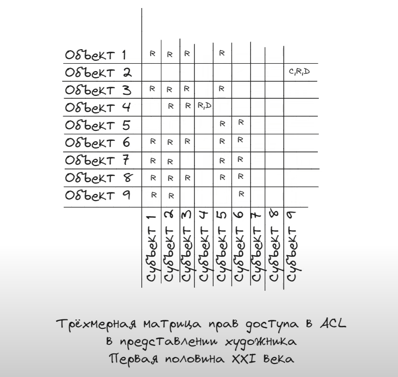

## #24 Spring Security: ACL // ДЗ 

---
### Credentials

1. Log -> user | Pass -> password | Permissions -> READ 
2. Log -> admin | Pass -> password | Permissions -> READ , WRITE, CREATE
3. Log -> editor | Pass -> password | Permissions -> READ , WRITE, CREATE, DELETE, ADMINISTRATION

---

ACL - реализация авторизациии на основе матрицы прав доступа. Эта матрица - трёхмерная, и выглядит примерно как на скрине ниже.
Горизонталь означает объекты, вертикаль - субъекты (т.е. люди) а "глубина", т.е. третья плоскость, означает права доступа. 
В Spring Security, в ACL нет третьей плоскости, потому что права реализованы на счёт маски. Т.е. берется обычный int и его биты представляют собой набор правил, куда пользователю можно или нельзя.

Так же в ACL реализовано наследование, которое может применяться и к объектам (когда один объект является потомком другого) так и в рамках субъектов (USER имеет все права что GUEST + дополнительные).
ACL генерирует большой объем данных и часто используется в больших проектах где так же много данных, поэтому часто с ACL добавляют кэширование. Я не знаю, можно ли без него, так что попробую с ним.

Так же интересным моментом является то, что ACL умеет работать только с реляционными БД.

До применения Spring ACL у меня из сервисного слоя возвращались DTO объекты.
Однако в таком случае аннотации которые там работают (например `@PostFilter` в методе `findAll()`) проверяют доступ не к классу Book, а к классу BookDto.
Класс BookDto нельзя добавить в список сущностей, за которыми ACL следит по двум причинам
* Это неверно с точки зрения архитектуры, так как DTO объекты не должны храниться в бд, а должны представлять собой объект полученный из БД
* DTO объекта нет в БД и настроить к нему доступ для каких то прав или пользователей тоже не возможно.
Поэтому я нашел способ вызывать для данных в аннотации @PostFilter и тд методы. Например у меня вызывается метод маппера toBook в `findAll()` для всех книг.
Этот метод применяется к каждому элементу из filterObject.
Однако там надо явно указывать имплементацию, а то Spring (по какой то причине) не найдет.
И я не знаю точно ли надо указывать вот такие выражения в методах помеченных @PreAuthorize. По логике - ведь не надо? 

UPD: Надо. Потому что @PreAuthorize проверит доступность до того, как зайти в метод. Для этого он возьмет ID сущности и проверит имеет ли пользователь право.
Однако у BookCreateDto например нет ID, потому что он должен генерироваться при создании.
Таким образом получается что нужно authority CREATE вообще сюда не впихнуть, потому что ID нет. 
Пэтому сделал проверку по ROLE.

Однако после проверки на возможность создания нужно предоставить возможность всем трём читать.

UPD 19.10.2024: 
1. Оказывается необязательно выдавать доступ на ту сущность, которая хранится в базе. Есть доменная модель, которая в виде таблице в БД и есть Entity класс у нас в приложении.
Я думал что необходимо в ACL использовать эту же Entity. Оказывается нет, чтобы не плясать с бубном применяя SPEL выражения над методами в аннотациях (как я делал в предыдущем коммите) - можно выдавать права на DTO